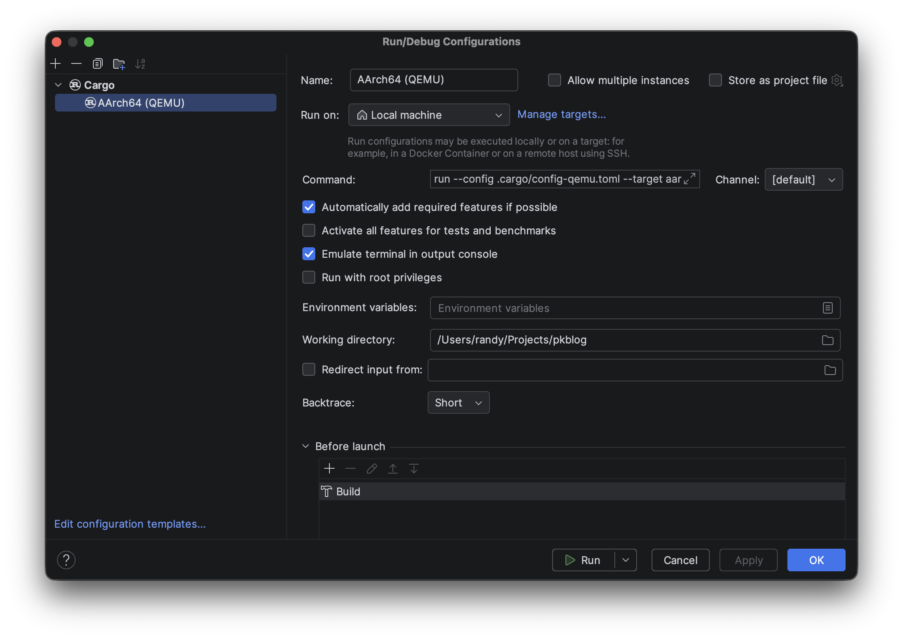

# THE PROPELLER KERNEL - PART 2

## Introduction

This is going to be a whirlwind. The goal of Part 2 is to get the tooling setup to build a *minimal* kernel: a simple infinite loop. However, getting there is going to involve a lot of steps.

Pay attention to the tooling more than any actual code. Part 3 will take a step back and reflect on some major kernel concepts before the tutorial moves forward.

## Setting Up the Rust Toolchains

[`rustup`](https://rustup.rs/) is the easiest way to install Rust and the necessary targets. Once you have `rustup` installed, run the following to install the ARM cross-compiler targets:

```
$ rustup target add aarch64-unknown-none-softfloat
$ rustup target add armv7a-none-eabi
```

> *NOTE:* Notice the use of the software floating-point targets (ARM eabi vs. eabihf, and AArch64 softfloat),  Propeller avoids floating-point operations in the kernel to avoid the need to save floating-point registers during system calls and interrupts. Later in this part, we will also disable NEON SIMD for the same reason.

The build tooling is also going to need the [`llvm-tools`](https://internals.rust-lang.org/t/llvm-tools-a-new-rustup-component-for-binary-inspection-objdump-nm-size-and-profiling-profdata/7830) component for `rustup`. Run:

```
$ rustup component add llvm-tools
```

Install [`cargo-binutils`](https://github.com/rust-embedded/cargo-binutils):

```
$ cargo install cargo-bintuils
```

`cargo-binutils`, built on `llvm-tools`, installs utilities such as `rust-objcopy` and `rust-objdump` that the build tooling will use to create the raw kernel image and disassembly listing.

## Setting Up the ARM Toolchains

On UNIX-like systems, I usually put the ARM toolchains in:

```
$HOME/.local/cross/gnu-arm-none-eabi

$HOME/.local/cross/gnu-aarch64-none-elf
```

The build tooling will use the [`cc`](https://docs.rs/cc/latest/cc/) crate to compile assembly files. So, let's set up a global Cargo configuration tells the `cc` crate where the compiler and archiver binaries are for each target.

Create the file `$HOME/.cargo/config.toml` and add the following lines (replace `<ARM_PATH>` and `<AARCH64_PATH>` with the root directories of the toolchains):

```toml
[env]
CC_aarch64_unknown_none_softfloat = "<AARCH64_PATH>/bin/aarch64-none-elf-gcc"
AR_aarch64_unknown_none_softfloat = "<AARCH64_PATH>/bin/aarch64-none-elf-ar"
CC_armv7a_none_eabi = "<ARM_PATH>/bin/arm-none-eabi-gcc"
AR_armv7a_none_eabi = "<ARM_PATH>/bin/arm-none-eabi-ar"
```

## Create a New Rust Project

The easiest way to create a new project is to just use Cargo:

```
$ cargo new --bin propeller
```

This is going to create a binary that depends on the Rust standard library: your run-of-the-mill executable. Once you create the new project, open it in RustRover.

Now, the new project builds a run-of-the-mill executable with a familiar "Hello, World!" `main` function. But, we don't want a run-of-the-mill executable. We want a bare-metal superstar, an unconstrained master of its domain.

## no_std

Go ahead and delete the `main` function Cargo creates in `<propeller>/src/main.rs` and let's build out some minimal Rust code:

```rust
//! Propeller Rustland Entry Point.

// No standard library; we will use core instead.
#![no_std]

// No main entry point.
#![no_main]

// When debug assertions are enabled (i.e. this is a debug build),
// allow unused variables and code.
#![cfg_attr(debug_assertions, allow(unused))]

use core::panic::PanicInfo;

/// Panic handler.
///
/// # Parameters
///
/// * `info` - Information about the panic.
#[panic_handler]
fn panic(_info: &PanicInfo) -> ! {
   // Busy halt
  loop {}
}
```

The `#![no_std]` directive tells the compiler to use the dependency-free Rust [`core`](https://doc.rust-lang.org/stable/core/index.html) library instead of the standard library. As noted in the documentation for `core`, it does not include any features that use dynamic memory, concurrency, I/O, etc. These are features that require an operating system: the thing we are building.

The `#![no_main]` directive tells the linker not to expect a `main` function. This will be handled by a custom linker script later.

Finally, the code sets up a custom Panic handler that just halts. This is pretty much the only Rust code we are going to write for a while.

## Cargo.toml

Update `<propeller>/Cargo.toml` to abort on a panic and add `cc` as a build dependency:

```toml
[package]
name = "propeller"
version = "0.1.0"
edition = "2024"

[dependencies]

[profile.dev]
panic = "abort"

[profile.release]
panic = "abort"

[build-dependencies]
cc = "1.0"
```

Without the standard library, using Rust's normal stack-unwinding panic recover is not possible.

Do not bother trying to build yet. We are still just getting started.

## Post-Build Python Script

Propeller uses a [post-build script](https://github.com/slakpi/Propeller-Kernel/blob/999066fd38e1c0fac8e593a8dc15306c2ec2d2cd/support/post-build.py) to generate the raw kernel image and disassembly listing. You can place this script in `<propeller>/support`.

## Project Cargo Configurations

The global Cargo configuration specifies the toolchain binaries. Now, you need to set up project configurations for the different build targets. Create a common configuration file at `<propeller>/.cargo/config.toml`. This file will inherit the global configuration.

```toml
# Common Build Configuration

# This configuration cannot be used on its own.

[target.aarch64-unknown-none-softfloat]
rustflags = [
    "-C", "link_arg=-Tsrc/arch/aarch64/start/start.ld",
]
runner = ".venv/bin/python support/post-build.py"

[target.armv7a-none-eabi]
rustflags = [
    "-C", "link_arg=-Tsrc/arch/arm/start/start.ld",
]
runner = ".venv/bin/python support/post-build.py"

[env]
# CC_<arch> and AR_<arch> should be defined in the user's global cargo config.
# See https://doc.rust-lang.org/cargo/reference/config.html.
#   NOTE: The configuration files assume the ARM GNU toolchain is used.
```

The `[target.<target>]` sections specify Rust compiler options for individual targets. Each target uses `rustflags` to specify a GNU linker script that details the layout of the kernel image.

Each target also specifies `post-build.py` as the "runner" for the target. `cargo build` will build the kernel, but we can use the post-build script as the "runner" to create the raw image and disassembly listing.

Let's also create a configuration file for QEMU. Create another configuration file called `<propeller>/.cargo/config-qemu.toml`. This file will inherit the project and global `config.toml`.

```toml
# QEMU Platform Build Configuration

# Use the Raspberry Pi 3 profile for AArch64 builds and the Raspberry Pi 2
# profile for ARM builds.

[target.aarch64-unknown-none-softfloat]
rustflags = [
    "-C", "target-feature=-neon",
    "-C", "target-cpu=cortex-a53",
    "-C", "link_arg=--section-start=.text=0xffff000000080000",
]

[target.armv7a-none-eabi]
rustflags = [
    "-C", "target-cpu=cortex-a7",
    "-C", "link_arg=--section-start=.text=0xc0010000",
]

[build]
target = ["aarch64-unknown-none-softfloat", "armv7a-none-eabi"]

[env]
CFLAGS_aarch64_unknown_none_softfloat = "-mcpu=cortex-a53 -march=armv8-a+nofp+nosimd -fPIC"
CFLAGS_armv7a_none_eabi = "-mcpu=cortex-a7 -march=armv7ve -fPIC"
```

Here, we get a bit more specific with the flags we send to the Rust compiler.

For AArch64:

* Disable NEON SIMD instructions.
* Optimize for the Cortex-A53.
* Start the kernel code at 0xffff_0000_0008_0000. QEMU's boot loader will jump to 0x8_0000 expecting to find the kernel code, but we need to specify the virtual address here (more on this later).

For ARMv7a:

* NEON intrinsics are not available in the `eabi` toolchain, so that's already taken care of.
* Optimize for the Cortex-A7.
* Start the kernel code at 0xc001_0000. QEMU differs from the Raspberry Pi boot loader here. The Raspberry Pi boot loader will expect the kernel code at 0x8000, but QEMU's boot loader expects it at 0x1_0000 Again, specify the virtual address here (more on this later).

The `[build]` section specifies the targets to build with the `cargo build` command.

The `[env]` section provides the flags used when compiling assembly files with ARM toolchains. These flags are mostly just GCC equivalents of the Rust flags above.

> *NOTE:* `-fPIC` generates position-independent code from the assembly source. This is important because we are telling the linker to use a virtual base address for the kernel. When compiled, the assembly code will use PC-relative addresses rather than absolute virtual addresses. While the MMU is off, virtual addresses will just point to Nowhereland.

> *NOTE:* `-march=armv7ve`? For the ARMv7a target, the configuration tells GCC to use the ARMv7ve architecture. This is really just ARMv7-A with Virtualization Extensions, i.e. the Cortex-A7 and Cortex-A53.

## AArch64 Entry Point

We are inching closer to being able to build! Hang in there and just think about how satisfying the first build will be.

Let's add the entry point assembly. Propeller keeps its architecture-dependent code under `<propeller>/src/arch`. Each architecture has a `start` module that contains all of the assembly code. You could write Rust [inline assembly](https://doc.rust-lang.org/reference/inline-assembly.html) with the `asm!` macro, however debugging pure assembly is much easier.

Add the file `<propeller>/src/arch/aarch64/start/start.s`:

```asm
//! AArch64 Entry Point

.section ".text.boot"

///---------------------------------------------------------------------------
///
/// Kernel entry point.
///
/// # Parameters
///
/// * w0 - 32-bit pointer to the ATAG/DTB blob
/// * x1 - Zero
/// * x2 - Zero
/// * x3 - Zero
/// * x4 - Address of this entry point
.global _start
_start:
1:
  wfi
  b       1b

section ".text"
```

This very exciting assembly code defines a section named `.text.boot`, a global function named `_start` and another section named `.text`.

The linker places executable code in the `.text*` sections. The `.text.boot` section is a subsection of `.text` that the linker script will place starting at the kernel base address. The linker will be free to arrange code in `.text` however it wants.

The `_start` function simply goes into an infinite loop using the `wfi` instruction to sleep until an interrupt occurs.

Do not worry too much about the parameters passed to `_start`. When the boot loader calls `_start`, it will call it the registers set as specified. The ATAG/DTB blob is going to be a big topic later.

## AArch64 Linker Script

Now add the file `<propeller>/arch/aarch64/start/start.ld`:

```
__page_size = 4096;

ENTRY(_start)

SECTIONS
{
  .text :
  {
    KEEP(*(.text.boot))
    *(.text)
  }

  .rodata : ALIGN(__page_size)
  {
    *(.rodata .rodata.*)
  }

  .data : ALIGN(__page_size)
  {
    *(.data)
  }

  .bss : ALIGN(__page_size)
  {
    __bss_start = .;
    *(.bss .bss.*)
    . = ALIGN(__page_size);
    __bss_end = .;
  }
  
  __bss_size = __bss_end - __bss_start;
}
```

This very simple linker script does the following:

`__page_size = 4096;` - We will talk about page sizes more later. For now, this is just a constant for aligning sections in the binary. It is not actually telling the processor to use 4 KiB pages.

`ENTRY(_start)` - Tells the linker that `_start` is the kernel entry point.

`SECTIONS` - Defines the section layout in the binary.

`KEEP(*(.text.boot))` - Tells the linker not to discard the `.text.boot` section and to place it at the beginning of the binary.

`*(.text)` - Place the rest of `.text` after `.text.boot`.

`ALIGN(__page_size)` - Moves the current position to a 4 KiB boundary. This is used to align sections and can also arbitrarily align the current position using `. = ALIGN(__page_size)`.

> *NOTE:* The BSS section is the zero-initialized data section. The `__bss_start`, `__bss_end`, and `__bss_size` constants will make it easier to memset the BSS section to 0 later on.

You can read more about the GNU linker script format [here](https://sourceware.org/binutils/docs/ld/Scripts.html#Scripts).

## build.rs

Believe it or not, Cargo is *still* unable to build the kernel!

Cargo is a programmable build system, that uses, surprise!, Rust as its language. We need to provide Cargo with a build script that tells it how to compile the assembly files.

Add the file `<propeller>/build.rs`:

```rust
use cc;
use std::env;

/// Build script entry.
fn main() {
  let target_arch = env::var("CARGO_CFG_TARGET_ARCH").unwrap();

  let mut cfg = cc::Build::new();

  // None of the default flags are needed. The cargo configuration files
  // will set the required architecture and CPU flags.
  cfg.no_default_flags(true);

  if target_arch == "aarch64" {
    configure_for_aarch64(&mut cfg);
  } else {
    panic!("Invalid target architecture.");
  }

  cfg.compile("start");
}
```

Cargo provides the `main` function with the target architecture through an environment variable. Once we know the target architecture, the script instantiates a `cc::Build` object and starts configuring it to compile the assembly files.

The last line in `main` tells `cc` to compile the assembly files.

Let's add the `configure_for_aarch64` function:

```rust
/// Configure start module build for AArch64.
///
/// # Parameters
///
/// * `cfg` - The start module builder.
fn configure_for_aarch64(cfg: &mut cc::Build) {
  const AARCH64_START_FILES: [&'static str; 1] = [
    "src/arch/aarch64/start/start.s",
  ];

  cfg
    .include("src/arch/aarch64/start/include")
    .files(&AARCH64_START_FILES);

  println!("cargo:rerun-if-changed=src/arch/aarch64/start/start.ld");

  for file in &AARCH64_START_FILES {
    println!("cargo:rerun-if-changed={}", file);
  }
}
```

`AARCH64_START_FILES` is just an array where we will keep a list of the assembly files to compile.

The next line adds an include path for use later, and adds the list of assembly files to the build.

Build scripts communicate back to Cargo via `println!`, and the next couple of lines tell Cargo to rerun a build if the linker script or any of the assembly files change.

## RustRover Specifics

The project `config.toml` file uses `.venv/bin/python` to execute the post-build script, so use `Settings` > `Build, Execution, Deployment` > `Python Interpreter` to add a Python 3.9 (or higher) virtual environment at `<propeller>/.venv`.

Now use `Run` > `Edit Configurations...` to set up build configurations in RustRover.



Remove any existing Cargo configurations, then add a new Cargo configuration.

Rename the configuration from "Run" to "AArch64 (QEMU)".

Change the Command field to:

```
run --config .cargo/config-qemu.toml --target aarch64-unknown-none-softfloat -- --image kernel8.img
```

This tells RustRover to execute `cargo run` using the QEMU configuration and the AArch64 target. The parameters after `--` are passed to the post-build script. In this case, the `--image kernel8.img` parameter is the name of the raw kernel image file the post-build script will output.

## GO!

Guess what. It's time! It really is!

Make sure "AArch64 (QEMU)" is selected as the current configuration, then click the Run button.


If all goes well, the build will succeed!

You should find the following files under `<propeller>/target/aarch64-unknown-none-softfloat/debug`:

* asm.txt
* kernel8.img
* propeller

Open `asm.txt` and search for "Disassembly of section .text". You should see the `_start` function listed with the `wfi` and `b` instructions.

You could run this in QEMU, and you will. But, for now, take a breath and rejoice. You have built the world's dumbest kernel.

Yeah. I told you it would be satisfying.

-----
[Part 3](https://slakpi.github.io/Propeller-Kernel/part_3.html)