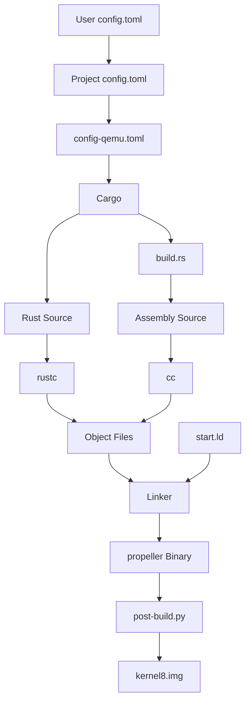

# THE PROPELLER KERNEL - PART 3

## Introduction

We did *a lot* in Part 2, and did not have a whole lot of space to put everything in context. So, let's take a step back and reflect on what has been accomplished so far before moving forward.

## Build Tooling

We have a working build system now and, over time, we will add to it. But, we have a solid foundation for now:



The user, project, and platform `config.toml` files feed Cargo.

Cargo uses `rustc` to compile the Rust source and uses the `build.rs` script to delegate compiling the architecture assembly source to `cc`.

The linker uses the architecture `start.ld` script to link the object files into a binary.

Finally, the `post-build.py` script uses `rust-objcopy` from `cargo-binutils` to produce a raw binary image of the kernel.

This raw binary can be dropped onto a SD card and booted by a Raspberry Pi, or loaded into QEMU. We will try this in Part 4 to introduce debugging.

## No Floating-Point or SIMD

We talked about using the software floating-point targets and disabling [NEON SIMD](https://en.wikipedia.org/wiki/ARM_architecture_family#Advanced_SIMD_(Neon)). When user code traps into the kernel for a [system call](https://en.wikipedia.org/wiki/System_call), we can save a great deal of time by not saving/restoring the floating-point and SIMD registers to/from memory *IF* we can guarantee that the kernel will not modify them.

Using the software floating-point toolchains and disabling SIMD will ensure that compiler does not use vectorization optimizations and any use of floating-point or SIMD instructions will raise an exception.

## Virtual Addresses

We talked about specifying the base address of the kernel as a virtual address.

I highly recommend reading this primer on [virtual addressing](https://diveintosystems.org/book/C13-OS/vm.html) and this tutorial on AArch64 [address translation](https://github.com/s-matyukevich/raspberry-pi-os/blob/master/docs/lesson06/rpi-os.md) if virtual addressing is new to you.

For ARM, the 32-bit virtual address space will look like:

         2:2 Split                             3:1 Split
         ---------                             ---------

    +-----------------+ 0xffff_ffff       +-----------------+ 0xffff_ffff
    |                 |                   |                 |
    |                 |                   | Kernel Segment  | 1 GiB
    | Kernel Segment  | 2 GiB             |                 |
    |                 |                   +-----------------+ 0xc000_0000
    |                 |                   |                 |
    +-----------------+ 0x8000_0000       |                 |
    |                 |                   |                 |
    |                 |                   | User Segment    | 3 GiB
    | User Segment    | 2 GiB             |                 |
    |                 |                   |                 |
    |                 |                   |                 |
    +-----------------+ 0x0000_0000       +-----------------+ 0x0000_0000

Most 32-bit processors provide different split modes for the address space. Windows and Linux use a 3:1 split to support up to 3 GiB of physical memory. There is a performance cost to this, however, that we will discuss later.

For AArch64, the 64-bit virtual address space will look like:

    +-----------------+ 0xffff_ffff_ffff_ffff
    |                 |
    | Kernel Segment  | 256 TiB
    |                 |
    +-----------------+ 0xffff_0000_0000_0000
    | / / / / / / / / |
    | / / / / / / / / |
    | / / / / / / / / | 16,776,704 TiB (Unused)
    | / / / / / / / / |
    | / / / / / / / / |
    +-----------------+ 0x0000_ffff_ffff_ffff
    |                 |
    | User Segment    | 256 TiB
    |                 |
    +-----------------+ 0x0000_0000_0000_0000

Yep. The kernel and every user task get 256 TiB of virtual address space. 16,776,704 TiB (just under the full 16 EiB) of address space lay unused.

In both the ARM and AArch64 cases, the kernel's virtual addresses will be in the upper portion of the address space when the MMU is *ON*. We specified the virtual base address of the kernel in the layout of the image anticipating this.

However, per the Linux boot protocols used by the Raspberry Pi, the MMU will be *OFF* at boot, and regardless of what we specify in the linker script, the Raspberry Pi and QEMU boot loaders are going to load the kernel to a physical address that is decidedly not the same as the virtual address. In the case of a 32-bit kernel, the Raspberry Pi loads the kernel starting at 0x8000 and QEMU loads the kernel starting at 0x1_0000. In the case of a 64-bit kernel, both load the kernel starting at 0x8_0000.

The boot loader is just going to set the [`PC`](https://en.wikipedia.org/wiki/Program_counter) to the starting *physical* address, and the processor is just going to increment the `PC` as it reads instructions. No big deal so far.

What if the kernel code wants to perform a jump or load some data, though? We told the linker to use virtual addresses. If the processor tries to jump to or load from an absolute virtual address it is going to end up halting on a bad address.

This is where the `-fPIC` option to generate position-independent code from the architecture assembly source comes in. The compiler will generate code that jumps to or loads from addresses calculated by adding an offset computed at compile-time to the `PC`. The early boot code does not have to know anything about virtual or physical address; it just has to deal in offsets! 

## Kernel Image Layout

To review, our kernel image has the following layout so far:

    +-----------------+
    | / / / / / / / / | (page alignement)
    |.................|
    | .bss            |
    |.................|
    | / / / / / / / / | (page alignement)
    |.................|
    | .data           |
    |.................|
    | / / / / / / / / | (page alignement)
    |.................|
    | .rodata         |
    |.................|
    | / / / / / / / / | (page alignment)
    |.................|
    | .text           |
    |                 |
    | .text.boot      |
    +-----------------+ base address

The `_start` function is the only function in the `.text.boot` section, and it is placed there so that the linker script can ensure that it is placed at the exact beginning of the kernel.

We will add a few more things to the linker script as we go, but this is pretty much as complicated as the kernel image gets.

## Rust?

Before the kernel can jump to any Rust code, it is going to have to do a lot of set up to meet the expectations of the Rust compiler. For example, Rust code assumes it has a stack. Where is the stack? Surely there is a stack somewhere! Well...no. I mean, yes...there's probably a pool of memory out there, but our kernel is in a dark cave at the moment with a woefully incomplete map of the system. Right now, that map is just a few constants provided by the linker script.

## ARM?

We only have an AArch64 implementation so far. I'll tell you what. I'll give you the code for the ARM version of `_start`, and you use what you have learned so far to integrate it into the build.

> *NOTE*: When loading a 32-bit kernel, the boot loader use by Raspberry Pi models 2 and 3 expects the file to be named kernel7.img. The boot loader on a Raspberry Pi 4 on expects the file to be named kernel7l.img.

```
//! ARM Entry Point

.section ".text.boot"

///-----------------------------------------------------------------------------
///
/// Kernel entry point.
///
/// # Parameters
///
/// * r0 - Zero
/// * r1 - Machine ID
/// * r2 - Pointer to the ATAG/DTB blob
.global _start
_start:
1:
  wfi
  b       1b


.section ".text"
```

OK, that's probably anti-climactic since the instructions are the same. I'll give you another hint: the linker script is the same for now. You can just copy it over.

Did you get it to build?

-----
[Part 4](https://slakpi.github.io/Propeller-Kernel/part_4.html)

<script src="https://cdn.jsdelivr.net/npm/mermaid@10.9.5/dist/mermaid.min.js"></script>
<script>
  // Wait for the page to fully load
  document.addEventListener('DOMContentLoaded', function() {
    // Find all Markdown code blocks with class "language-mermaid"
    const mermaidCodeBlocks = document.querySelectorAll('pre code.language-mermaid');
 
    // Convert each code block into a Mermaid diagram
    mermaidCodeBlocks.forEach(block => {
      // Create a new div for Mermaid to render into
      const mermaidDiv = document.createElement('div');
      mermaidDiv.className = 'mermaid'; // Match the CSS class above
      mermaidDiv.textContent = block.textContent; // Copy diagram code
 
      // Replace the original code block with the Mermaid div
      block.parentNode.replaceChild(mermaidDiv, block);
    });
 
    // Initialize Mermaid with default settings
    mermaid.initialize({
      startOnLoad: true, // Render diagrams when Mermaid loads
      theme: 'default', // Use default theme (options: default, dark, forest, neutral)
      logLevel: 3 // Suppress non-critical logs (0 = debug, 3 = error)
    });
  });
</script>